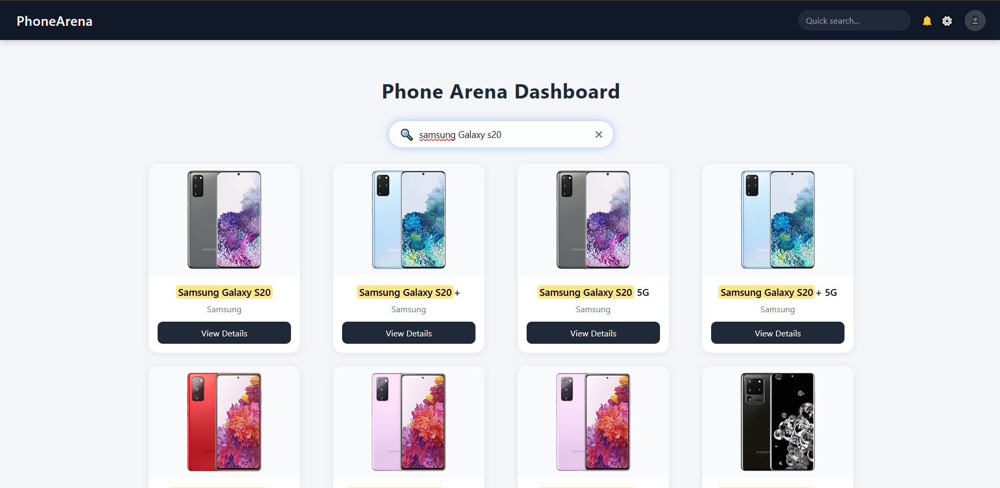

# Phone Dashboard

A **responsive phone dashboard** web application built with **React**, **TailwindCSS**, and custom CSS.  
It allows users to **search, view, and explore mobile phones** with detailed specifications in a modern, interactive interface.

---

## Preview

  

---

## Features

- **Responsive Navbar** with:
  - Logo, search bar, icons, and profile.
  - Mobile-friendly hamburger menu and sidebar toggle.
  
- **Sidebar Navigation**:
  - Smooth slide-in overlay on mobile.
  - Scrollable menu for long lists.
  
- **Search Functionality**:
  - Live search with clear button.
  - Smooth focus effects with blur background.
  
- **Phone Cards**:
  - Interactive card view with hover animations.
  - Displays phone image, brand, and title.
  - Mobile-optimized grid layout (1x3 for small screens).
  
- **Modal / Overlay**:
  - Detailed phone specifications.
  - Smooth fade-in and slide animations.
  - Mobile-friendly sizing and scrollable content.
  
- **Footer**:
  - Responsive footer with links and copyright.
  - Prevents horizontal overflow on mobile devices.

---

## 📂 Project Structure
src/
│
├── components/
│ ├── Navbar.jsx
│ ├── Sidebar.jsx
│ ├── Footer.jsx
│ ├── PhoneCard.jsx
│ ├── PhoneModal.jsx
│ ├── SearchBar.jsx
│
├── styles/
│ ├── navbar.css
│ ├── sidebar.css
│ ├── footer.css
│ ├── card.css
│ ├── modal.css
│ ├── search.css
│
├── App.jsx
└── index.css


---

## 🎨 Technologies Used

- **React** – UI library
- **TailwindCSS** – Utility-first CSS framework
- **Custom CSS** – For animations, overlays, modals, and fine-tuned styling
- **Flexbox & Grid** – For responsive layouts
- **CSS Animations** – Smooth hover and modal transitions

---

## ⚡ Installation & Setup

1. Clone the repository:

```bash
git clone https://github.com/yourusername/phone-dashboard.git
cd phone-dashboard

2. Install dependencies:
npm install

3. Start the development server:
npm start

Responsive Design

Desktop:
Full navbar with search, icons, and profile.
3-column card layout.
Sidebar visible on large screens optionally.
Tablet / Mobile:
Hamburger menu replaces navbar icons/search.
Sidebar slides in overlay.
Cards stack vertically (1 column or 1x3 grid for small phones).
Footer and text fit screen width without horizontal scrolling.

💡 Future Improvements
Integrate API for fetching live phone data.
Add filtering and sorting for brands and specs.
Implement dark/light theme toggle.
Add user authentication for personalized favorites.
Animate card and modal transitions further for smoother UX.